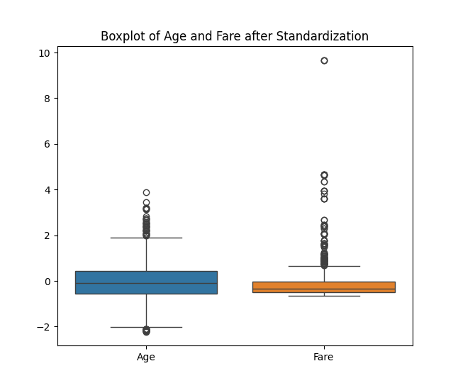

# Task 1: Data Cleaning & Preprocessing

This repository contains my work for **Task 1 of the Elevate Labs Internship**. The objective of this task was to clean and preprocess a raw dataset (Titanic) to make it suitable for machine learning models.

---

## 📌 Objective

- Explore and understand the raw Titanic dataset
- Handle missing data
- Encode categorical features
- Normalize numerical features
- Detect and remove outliers

---

## 🛠️ Tools & Libraries Used

- Python
- Pandas
- NumPy
- Matplotlib
- Seaborn
- Scikit-learn

---

## 🧪 Dataset Used

- **Name:** Titanic-Dataset.csv
- **Source:** [Kaggle Titanic Dataset](https://www.kaggle.com/c/titanic/data)

---

## 🔍 Steps Performed

### 1. **Exploratory Data Analysis**
- Loaded the dataset and checked data types, null values, and basic statistics.
- Identified key columns with missing data (`Age`, `Cabin`, `Embarked`).

### 2. **Handling Missing Values**
- Filled missing `Age` values using the **median**.
- Filled missing `Embarked` values using the **mode**.
- Dropped the `Cabin` column due to excessive missing values (~77%).

### 3. **Encoding Categorical Features**
- Converted `Sex` into binary values using **Label Encoding**.
- Applied **One-Hot Encoding** to the `Embarked` column.

### 4. **Feature Scaling**
- Standardized `Age` and `Fare` columns using **StandardScaler**.

### 5. **Outlier Detection and Removal**
- Visualized outliers using **boxplots**.
- Removed outliers in `Age` and `Fare` using the **IQR method**.

---

## 📸 Sample Output

---

## ✅ Final Result

- The cleaned dataset is free of missing values and major outliers.
- All features are encoded and scaled properly.

